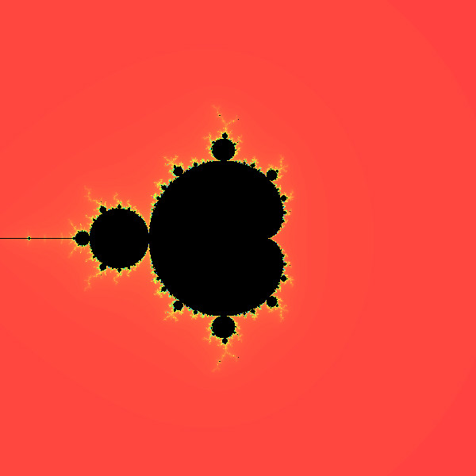
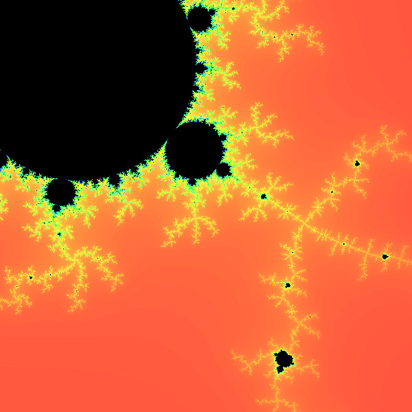
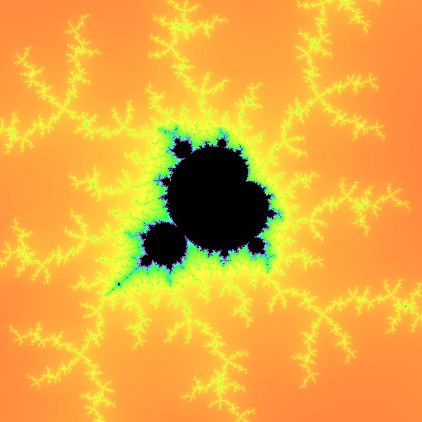

# MandelbrotSet

<p align="middle">
  
   
  
</p>

## Compilation

To compile you will need SFML and CMake installed on your system.
<br>
If above requirement is fulfilled, just run the following.
```bash
mkdir build && cd build
CXX=clang++ cmake -GNinja -DCMAKE_BUILD_TYPE=Release ..
ninja
./fractal
```

# Keybinds
```
Up: w
Down: s
Left: a
Right: d
K: zoom
J: unzoom
Left-Click: zoom into point.
Right-click un-zoom from point.
Up-Arrow: Increase iterations.
Down-Arrow: Decrease iterations.
P: save image in MandelbrotSet/images/fractal.jpg
Esq: quit
```
